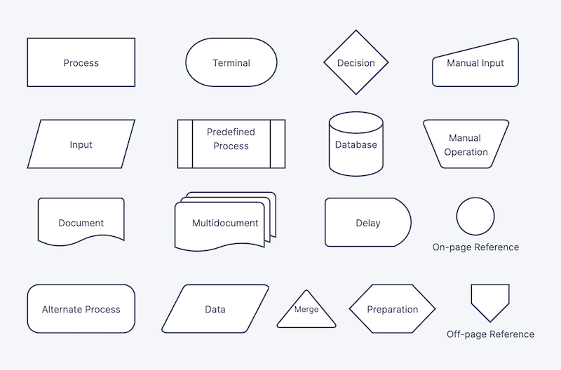
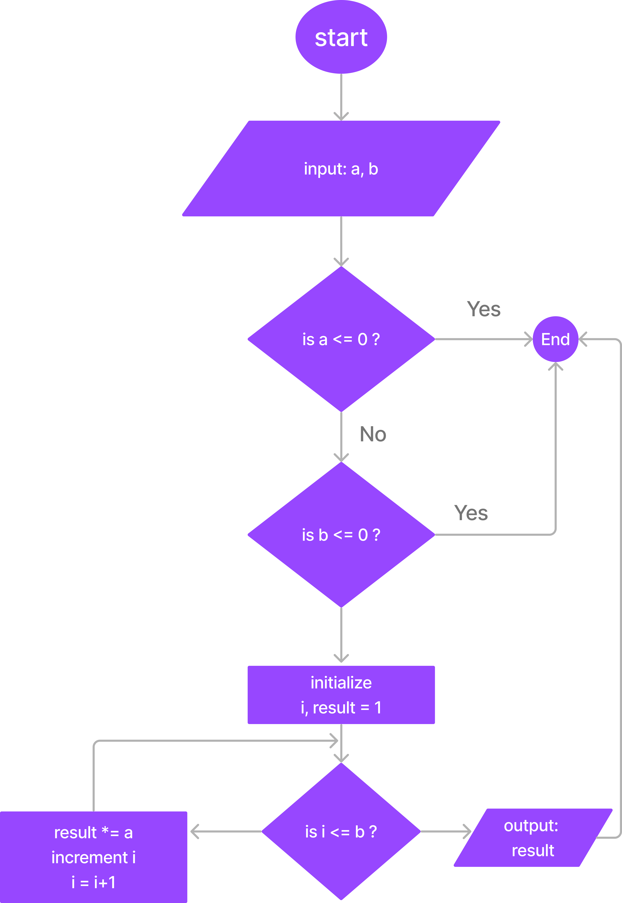

# Flowcharts and Diagrams

Flowcharts are a graphical representation of an algorithm. They are used to represent the flow of control in a program.

The algorithms are:

* Unambiguous/well-defined: Each step performs a very clear and unambiguous task.
* Finite: The total number of steps in the algorithm is finite. So, the algorithm will terminate after executing these steps and provide a definite output.

Any structured programming language supports three types of statements (constructs), and these are:

1. Sequencing: Executing a set of statements in a sequential order 	
2. Decision-making: Choosing from many alternative paths
3. Repetition/Iteration: Executing one or a group of statements in a loop iteratively

Flowcharts are made up of different symbols that represent different elements of the program. The symbols are connected by arrows to show the flow of control.

| Symbol                  | Purpose                     | Description                                                      |
| ----------------------- | --------------------------- | ---------------------------------------------------------------- |
| Arrow symbol            | Flow Line                   | Indicates the flow of logic by connecting symbols                |
| Oval                    | Terminal(Stop/ Start)       | Represents the start and end of a flowchart                      |
| Parallelogram           | I/O                         | Used for input and output operations.                            |
| Rectangle               | Processing                  | Used for arithmetic operations and data manipulations.           |
| Diamond                 | Decision                    | Used for decision making between two or more alternatives        |
| Circle                  | On-page connected           | Used to join different flowline                                  |
| Circle Downward Pointed | Off page connector          | Used to connect the flowchart on a different page                |
| Margined Rectangle      | redefined Process/ Function | Represents a group of statements performing one processing task. |

