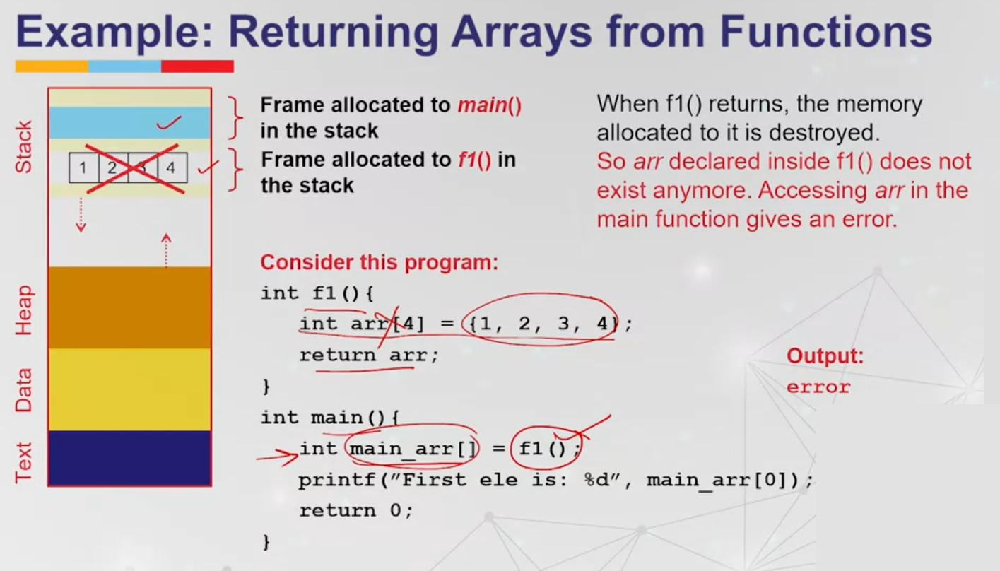

# Memory Allocations

Memory allocation is a process by which computer programs and services are assigned with physical or virtual memory space. The memory allocation is done either before or at the time of program execution. 

A memory is divided into 4 different portions:

  1. Stack segment
  2. Heap segment
  3. Data segment
  4. Text segment

#### Stack

- One frame is allocated to each function call
- Auto (or local) variables defined the frame allocated for a function
- Storage allocated for each frame is reclaimed when the function call is complete

#### Heap

- Dynamically and explicitly allocated memory
- It is a large pool of memory in which the program can request memory dynamically at runtime.. Allocated storage is not reclaimed automatically on function return. In heap, the memory is allocated or deallocated without any order.
- Programmer is responsible for deallocation
- The memory allocated in a head is accessible globally to all functions.   

There are two types of memory allocations: 

  1. Compile-time or Static Memory Allocation
  2. Run-time or Dynamic Memory Allocation

## Compile-time or Static Memory Allocation

```C
int main(){
    int variable = 10;
}
```

When allocating memory at compile-time, the size at the time of declaration is fixed and cannot be changed during the execution of the program. The memory is allocated on the stack.

## Run-time or Dynamic Memory Allocation

```C
int main(){
    int *ptr = (int*)malloc(sizeof(int));
    *ptr = 10;
    free(ptr);
}
```

When allocating memory at run-time, the size of memory can be changed during the execution of the program. The memory is allocated on the heap. 

<!-- > Heaps are based on complete binary trees. This means all levels are filled except possibly the last, which is filled from the left side. Elements are stored in an array using a specific indexing scheme for efficient access to parent and child nodes. Heaps are efficient for priority queues, where elements with higher priorities need to be accessed first. -->

## Dynamic Memory Allocation using malloc() a.k.a Memory Allocation

`malloc()` is a bulit in function declared in `stdlib.h` header file. It is used to dynamically allocate a block of memory on the heap. The function returns a pointer of type `void` which can be cast into a pointer of any form.

```C
#include <stdio.h>

(void* ) malloc (size_t size);
```


The `malloc()` function takes the number of bytes to be allocated as an argument and returns a pointer to the first byte of the allocated memory. If the memory allocation is successful, the function returns a pointer to the first byte of the allocated memory. If the memory allocation fails, the function returns `NULL`.

Malloc allocates memory without knowing the type of data to be stored in the memory. It is the programmer's responsibility to typecast the pointer to the appropriate type.


```C
#include <stdio.h>
#include <stdlib.h>

int main() {
    int i, n;
    printf("Enter the number of integers: ");
    scanf("%d", &n);
    int *ptr = (int *)malloc(n * sizeof(int));

    if (ptr == NULL) {
        printf("Memory not available.");
        exit(1);
    }

    for (i = 0; i < n; i++) {
        printf("Enter an integer: ");
        scanf("%d", ptr + i);
    }

    for (i = 0; i < n; i++)
        printf("%d ", *(ptr + i));

    return 0;
}
```


### Dynamic Arrays

|                   | Static Arrays                            | Dynamic Arrays                              |
| ----------------- | ---------------------------------------- | ------------------------------------------- |
| Syntax            | `int arr[10];`                           | `int *arr = (int*) malloc(sizeof(int)*10);` |
| Storage           | Stack frame of the function defining it. | Heap Area                                   |
| Use of pointers   | Implicit use of pointers                 | Explicit use of pointers                    |
| Re-sizing         | Arrays can't be resized once defined     | Arrays can be resized                       |
| Size of the array | Small sized arrays only                  | Large arrays can also be initialized        |




Returning Arrays from Functions Solutions:

1. Declare array in the calling function and pass it to the called function.

```C
#include <stdio.h>
#include <stdlib.h>


void copy(int c[], int n, int d[]){
    for (int i = 0; i < n; i++){
        d[i] = c[i]
        // or *(b+1) = *(a+i);
    }
}

int main() {
    int a[5] = {1, 2, 3,4, 5};
    int b[5];
    
    copy(a, 5, b);
    
    for(int i = 0; i < 5; i++){
        printf("%d\t", b[i]);
    }

    return 0;
}
```

2. Declare a pointer inside the called function, allocate memory and return the pointer to calling function.
   * Since memory is allocated in the heap, it will also be accessible in the calling function.

```C
#include <stdio.h>
#include <stdlib.h>

int *copy(int a[], int n){
    int *b = (int *) malloc(sizeof(int)*n);
    for (int i = 0; i < n; i++){
        b[i] = a[i];
        // or *(b+1)=*(a+i);
    }
    return b;
}

int main(){
    int a[5] = {1, 2, 3, 4, 5};
    int *b;
    
    b = copy(a, 5);
    
    for (int i = 0; i < 5; i++){
        printf("%d\t", b[i]);
    }
}
```

### Dynamic Structures

```C
struct student 
{
    char roll;
    int dept_code[25];
    float cgpa;
};
struct student *s;
s = (struct student *) malloc(sizeof(struct student));
```

The above code allocates a single structure variable dynamically. The malloc() function returns a void pointer, which we cast to a pointer to a structure of type struct student.


Similarly, we can allocate an array of structures dynamically using the following syntax:

```C
struct student *s_arr;
s_arr = (struct student *) malloc(10 * sizeof(struct student));
```

```C
#include <stdio.h>
#include <stdlib.h>
struct stud
{
    int roll;
    char dept_code[25];
    float cgpa;
};
int main()
{
    struct stud *studArray =
        (struct stud *)malloc(sizeof(struct stud *) * 10);
    int i = 0;
    while (i < 10)
    {
        printf("Enter roll no of student %d:", i);
        scanf("%d", &(studArray[i].roll));
        printf("Enter dept_code of student %d:", i);
        scanf("%s", &(studArray[i].dept_code));
        printf("Enter cgpa of student %d:", i);
        scanf("%f", &(studArray[i].cgpa));
        i++;
    }
    struct stud temp = studArray[0];
    i = 1;
    while (i < 10)
    {
        if (temp.cgpa < studArray[i].cgpa)
            temp = studArray[i];
        i++;
    }
    printf("The roll number of Student with max CGPA is: %d",
           temp.roll);
}
```


## Dynamic Memory Allocation using calloc() a.k.a Contiguous Allocation

It is different from `malloc()` in two ways:

1. `malloc()` does not initialize the memory allocated, while `calloc()` initializes the allocated memory to zero.
   - Both malloc and calloc return `NULL` when sufficient memroy is not available in the heap.

2. `malloc()` takes a single argument, the number of bytes to be allocated, while `calloc()` takes two arguments, the number of elements to be allocated and the size of each element.
    - malloc() way `int *ptr = (int *)malloc(n * sizeof(int));`

    - calloc() way `int *ptr = (int *)calloc(n, sizeof(int));`


## Dynamic Memory Allocation using realloc() a.k.a Reallocation

`realloc()` is used to change the size of the memory block that was previously allocated using `malloc()` or `calloc()`. The function takes two arguments, a pointer to the previously allocated memory block and the new size of the memory block. 

```C
void *realloc(void *ptr, size_t size);
```

The function moves the contents of the old block to a new block and returns a pointer to the newly allocated memory block. If the memory allocation is successful, the function returns a pointer to the first byte of the newly allocated memory block. If the memory allocation fails, the function returns `NULL`. The data of the old block is not lost. We may lose the data when the new size is smaller than the old size. Newly allocated memory is not initialized.

```C
#include <stdio.h>
#include <stdlib.h>

int main() {
    int *ptr = (int *)malloc(10 * sizeof(int));
    int i;

    if (ptr == NULL) {
        printf("Memory not available.");
        exit(1);
    }

    for (i = 0; i < 10; i++)
        *(ptr + i) = i;

    ptr = (int *)realloc(ptr, 20 * sizeof(int));

    if (ptr == NULL) {
        printf("Memory not available.");
        exit(1);
    }

    for (i = 10; i < 20; i++)
        *(ptr + i) = i;

    for (i = 0; i < 20; i++)
        printf("%d ", *(ptr + i));

    return 0;
}
```

## Releasing the Dynamic Memory Allocation using free()

The `free()` function is used to deallocate the memory that was previously allocated using `malloc()`, `calloc()`, or `realloc()`. The function takes a pointer to the memory block that needs to be deallocated as an argument. The function does not return any value.

```C
void free(ptr)
```

The memory allocated in the heap is not automatically deallocated when the program terminates. It is the programmer's responsibility to deallocate the memory using the `free()` function. If the memory is not deallocated, it leads to memory leaks.

```C
#include <stdio.h>
#include <stdlib.h>

int main() {
    int *ptr = (int *)malloc(10 * sizeof(int));
    int i;

    if (ptr == NULL) {
        printf("Memory not available.");
        exit(1);
    }

    for (i = 0; i < 10; i++)
        *(ptr + i) = i;

    for (i = 0; i < 10; i++)
        printf("%d ", *(ptr + i));

    free(ptr);

    return 0;
}
```

## Memory Leak

Memory leak is a situation where the programmer forgets to deallocate the memory that was previously allocated using `malloc()`, `calloc()`, or `realloc()`. Memory leaks can lead to the exhaustion of memory resources and can cause the program to crash. It is the programmer's responsibility to deallocate the memory using the `free()` function.

```C
#include <stdio.h>
#include <stdlib.h>

int main() {
    int *ptr;

    // Allocate memory for an integer
    ptr = (int *)malloc(sizeof(int));

    if (ptr == NULL) {
        printf("Memory allocation failed.");
        return 1;
    }

    // Assign a value to the allocated memory
    *ptr = 42;

    // Use the allocated memory
    printf("Value stored at allocated memory: %d\n", *ptr);

    // Free the allocated memory
    free(ptr);

    // Try to access the memory after freeing (This is undefined behavior)
    // Here, we are just printing the value at the memory location to demonstrate that it's not guaranteed to be zeroed out or invalidated after freeing.
    printf("Value after freeing memory: %d\n", *ptr);

    return 0;
}
```


