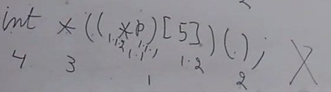

# Complex Pointers

Rules in order of precedence

1. `()` and `[]`
   1. Evaluated left to right
2. `*` and `id` Name of Pointer or identifier
   1. Evaluated right to left
3. Data Type


## Code Snippets with numbers indicating precedence

```C
int *p;
 3  21 
// declare p as pointer to int
```

```C
int **p;
 4  321
// declare p as pointer to pointer to int
```

```C
int *p[5];
 4  32 1
// declare p as array of 5 pointers to int
```

```C
int (*p)[5];
    .2 .1     # paranthesis # 1.1 and 1.2
 3    2  1
// declare p as pointer to array of 5 ints
```


```C
int *p();
 4  32 1
// declare p as function returning pointer to int
```

```C
int (*p)();
    .2 .1
 3    1  2
// declare p as pointer to function returning int
```

```C
int (*p)(int *);
    .2 .1
 3    1  2
// declare p as pointer to function that takes an int pointer returning int
```

```C
int **p();
 5  432 1
// declare p as function returning pointer to pointer to int
```

```C
int *(*p)();
    .2 .1
 4  3  1  2
// declare p as pointer to function returning pointer to int
```

```C
int (**p)();
    .3.2.1
 4  3  1  2
// declare p as pointer to pointer to function returning int
```

```C
int (*p)(int, char);
    1.2 1.1
         2.1  2.2
 3    1  2
// declare p as pointer to function
// taking int and char as arguments and returning int
```

```C
int **p[10];
 5  432 1
// declare p as array of 10 pointers to pointer to int
```

```C
int *(*p)[10];
     .2 .1
 4  3  1   2
// declare p as pointer to array of 10 pointers to int
```

```C
int (**p)[10];
     .3.2.1
 3    1   2
// declare p as pointer to pointer to array of 10 ints
```


```C
void *(**p[5])(int, char);
       .3.2.1
  4  3    1       2
// declare p as array of 5 pointers to pointer to function
// taking int and char as arguments and returning void pointer
```

```C
int (*(*p)[5])();
// declare p as pointer to array of 5 pointers 
// to function returning int
```

.png)

```C
int *(*(*p)(int))[10];
// p is pointer to function having int argumenet
// and returning pointer to array of 10 pointers to int
```

(int))[10].png)


```C
int *(*(*p[5])())();
// declare p as array of 5 pointers to function returning pointer 
// to function returning pointer to int
```

()).png)


```C
float(*(*p())[])();
// declare p as function returning pointer
// to array of pointers to function returning float
```

)[])().png)

```C
int *((*p)[5])();
// invalid declaration
```


