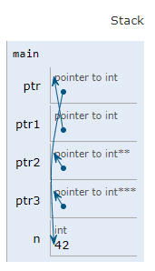

# Pointers in C

pointers are variables that store memory addresses of another variable. They allow direct manipulation of memory, which is a powerful feature but also requires careful handling to avoid errors.

## Basic Pointer Syntax

- Declaring a pointer: `int *ptr;` declares a pointer named `ptr` that can point to an integer value.
  
- Dereferencing a pointer: `*ptr` refers to the value stored at the memory address pointed to by `ptr`.

- Datatype of pointers is always an unsigned integer.

## Understanding declarations

`int n;` to get an int just use n

`int n[3]` to get an int just use n[i]

`int foo(int n, float n1);` to get an int just call foo with related inputs.

`int *n;` to get an int just dereference n

| *                      | &                |
| ---------------------- | ---------------- |
| value at               | address of       |
| *p; value at address p | &n; address of x |


### Void Pointers

- A pointer without an associated data type.
- Can point to any data type: int, float, char, long, structures, and more.
- Due to its generic nature, it cannot be dereferenced directly.

```C
int main(){
    generic  *ptr;
}
```

<!-- pointers contd -->

#### Generic Data Handling

Type casting to VOID* is a way to pass any type of data to a function. aka generic. It's a way to pass data without knowing the type of data. "we'll let you know bro".

we can do `void * `arithmetic with a GNU extention. 

```admonish info title = "GNU Extentions"

GNU Extention refers to additional language features or behaviour provided by GCC that go beyond the standard C language.

GNU C provided an extention called Pointer Arithmetic on `void *` that allows performing arithmetic operations on `void *` pointers by treating them as byte pointers. This extention is by default enabled in GCC.
```

## Pointer Arithmetic

The pointer arithmetic is done is done in terms of the size of char rather than the size of the pointer type. the size of the data type the pointer points to is considered. 

### Addition

-  **Integer addition to a Pointer is valid**. It increments the size of the data type it points to.
   - `ptr + n * sizeof(data_type)`

   ```C
   #include <stdio.h>

   int main(){
   long array[3] = {1, 2, 3};
   long *p = array;
   printf("%ld\n", *(p + 1)); // prints 2, you can use p[..] or *(p + ..)
   }
   ```

- **Pointer addition to Pointer is not valid in C** as the sum of two memory addresses doesn't logically translate to any meaningful value in most contexts.

  - multiplication and division between pointers also doesn't make sense in C and will cause a compiler error.


### Substraction

- Subtracting two pointers gives you their difference in memory addresses. The result is then divided by the size of the pointer's data type.
  - `P - P / sizeof(data_type)`
   ```C
   #include <stdio.h>

   int main(){
      long array[5] = {10, 20, 30, 40, 50};
      // Two pointers pointing to different positions in the array
      long *ptr_a = &array[1];  // Pointing to the value 20
      long *ptr_b = &array[3];  // Pointing to the value 40
      printf("Value at ptr_a: %ld\n", *ptr_a);  // Outputs: 20
      printf("Value at ptr_b: %ld\n", *ptr_b);  // Outputs: 40
      // Subtracting the pointers
      long difference = ptr_b - ptr_a;
      printf("Difference in positions: %ld\n", difference);  // Outputs: 2
      return 0;
   }
   ```
- Integer substraction to Pointer
  - `P - (int * sizeof(data_type))`
- You can only subtract pointers of the same type

<br>

---

```admonish info title = "Checkpoint"

- Arrays decay into pointers, except when used with the `&` operator. Decaying allows for more efficient memory usage.

- Whenever you work with an array identifier, most likely you are working with an pointer to element 0.

- `arr[n]` == `*(arr + n)`

- By decaying an array into a pointer, it allows for more efficient memory usage. When passing an array to a function, instead of creating a copy of the entire array, only the memory address of the first element is passed. This reduces the overhead of memory allocation and copying when dealing with large arrays.
```

---

## Function Pointers

Function pointers allow calling functions indirectly or taking their addresses.

The only 2 things we can do with a function is to either call it or take its address. 

So, if the name isn't followed by a `(`to signify a function call, then the name evaluates to the address of the function with no ambiguity.

```C
#include <stdio.h>

// Function prototypes
long long sum(int a, int b);
long long product(int a, int b);
// Define the function sum
long long sum(int a, int b){
    return a + b;
}
// Define the function product
long long product(int a, int b){
    return a * b;
}
int main(){
   // Declare a function pointer called operation
   long long (*operation)(int, int);
   // Assign the address of the sum function to operation pointer
   operation = &sum;
   // Use the function pointer to invoke the sum function
   printf("Using function pointer: %lld\n", operation(5, 7)); // Outputs: 12
   // Just for demo, let's switch the function pointer to point to the product function
   operation = &product;
   printf("Using function pointer to multiply: %lld\n", operation(5, 7)); // Outputs: 35
   return 0;
}
```

Practical use case: 

1. Event Handlers: In UNIX-like operating systems, signal handlers often utilize function pointers.

2. Callbacks: After a task completes, you might want to execute a specific function. Callbacks, often implemented via function pointers, allow this.

## Double Pointers

- Double pointers are just pointers pointing to other pointers.

- They're useful when you need to modify pointer values within functions.

- Like pointers, they're a tool: powerful when used correctly, but they can be confusing. Practice helps solidify understanding.


#### Quirks

```C
char* str[20];
```

Is str a pointer to an array of 20 characters, or is it an array of 20 pointers to characters?

This declaration creates an array of 20 pointers to characters, not the other way around. Here's why:

The array notation ([]) applies more closely to the variable than the pointer notation (*).
In essence, we've defined 20 of whatever type precedes the array brackets.
To confirm this, you can print the size of the array.


## argv[] or **argv 

argv[] or **argv represent pointers to pointers in C.

```C
int main(){
   int *ptr;
   int *ptr1;
   int ***ptr2;
   int ****ptr3;
   int n = 42;

   ptr = &n;
   ptr1 = &ptr;
   ptr2 = &ptr2;
   ptr3 = &ptr3;

   return 0;
}
```

