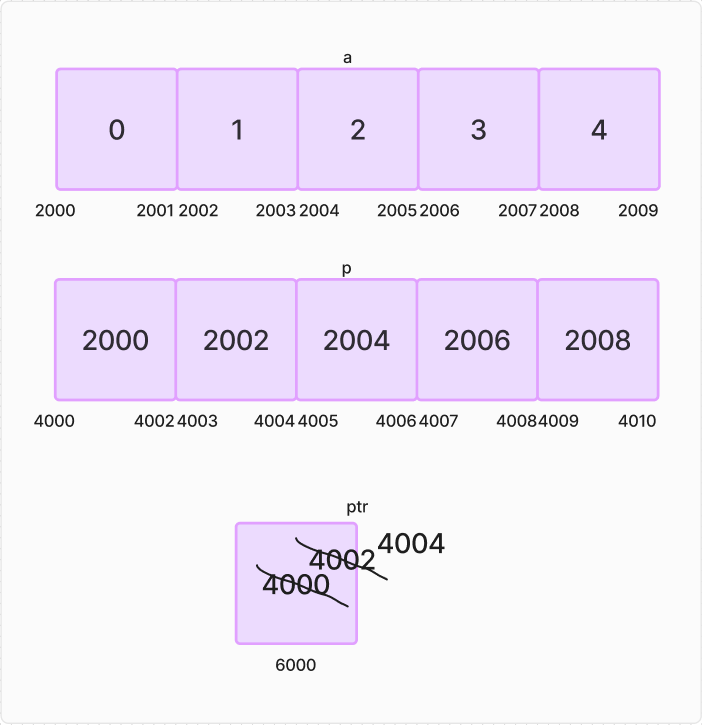

# Pointers and 1D Array

```C
int a;
int x[5];

a = 5;
x = 5; // Error

// Name of array is a constant pointer to 1st element of array. 

printf("%u",x);
printf("%d",*x);
printf("%d",*x+1);
printf("%d",*(x+1));
```

```
2000000
2000004
5
6
0
```

1. `printf("%u\n", x);` - This statement would print the memory address of the array x. The %u format specifier is used to print an unsigned integer, which is the format of memory addresses.

2. `printf("%d\n", x+1);` - This statement would print the memory address of the second element of the array x. The x array is implicitly converted to a pointer to its first element, and adding 1 to that pointer advances it to the next element.

3. `printf("%d\n", *x);` - This statement would print the value of the first element of the array x. The * operator is used to dereference the pointer to the first element, which retrieves the value stored at that memory location.

4. `printf("%d\n", *x+1);` - This statement would print the value of the first element of the array x plus 1. The *x expression retrieves the value stored at the memory location pointed to by x, and the +1 expression increments that value by 1.

5. `printf("%d\n", *(x+1));` - This statement would print the value of the second element of the array x. The x array is implicitly converted to a pointer to its first element, and adding 1 to that pointer advances it to the next element. The * operator is then used to dereference the pointer to the second element, which retrieves the value stored at that memory location.


```admonish danger title = "Not Allowed"
x++; or ++x;

x--; or --x;
```

~~~admonish success title = "Equivalents"
```C
x[0] = *x = *(x+0)

x[1] = *(x+1) = *x+1

x[1] = 1[x] = *(1+x)
```
~~~

### Passing 1D Array to Function

```c
#include <stdio.h>

void array(int *p){
        *p = 10;
        *(p+1) = 20;
        p[2] = 3;
        3[p] = 5;
}

int main() {
    int x[4];
    array(x);
    
    return 0;
}
```

As in above example, Generally 1D array is passed as call by reference. 

If we pass by value then we would not be able to change the value of array elements.

## Practice Questions

```c
#include <stdio.h>

int main() {
    int x[5] = {1, 3, 6, 9, 4};
    printf("%d\n", *x);
    printf("%d\n", *(x + 1));
    printf("%d\n", *x + 1);
    printf("%d\n", *(x + 1)+2;
    printf("%p\n", x);
    printf("%p\n", &x);
    printf("%p\n", x + 1);
    printf("%p\n", &x + 1);
    printf("%d\n", *x++);
    printf("%d\n", (*x)++);
    printf("%d\n", ++*x);
    printf("%d\n", *++x);

    return 0;
}
```

```
1
3
2
5
0x7ffee1234560
0x7ffee1234560
0x7ffee1234564
0x7ffee1234580
Error
1 
3
Error
```

1. `printf("%d\n", *x);`
   
   - prints the value stored at the address pointed to by `x`. Since `x` is an array, `*x` refers to the first element of the array, which is 1.

2. `printf("%d\n", *(x + 1));`
   
   - Prints the value stored at the address `x + 1`, which is the second element of the array, which is 3. The expression `x + 1` is a pointer arithmetic operation that moves the pointer to the next element of the array.

3. `printf("%d\n", *x + 1);` 
   
   - prints the sum of the first element of the array (1) and 1, resulting in 2.

4. `printf("%d\n", *(x + 1)+2);`
   
   - Prints the value of the second element of the array x (which is 3) plus 2, resulting in 5.

5. `printf("%p\n", x);`
   
   - Prints the address of the first element of the array, which is `0x7ffee1234560` (the actual address may vary).

6. `printf("%p\n", &x);`
   
   - Prints the address of the entire array, which is also `0x7ffee1234560`.

7. `printf("%p\n", x + 1);`
 
   - Prints the address of the second element of the array, which is `0x7ffee1234564`.

8.  `printf("%p\n", &x + 1);`
   
    - Prints the address of the memory location immediately after the array, which is `0x7ffee1234580`.

9.  `printf("%d\n", *x++);`

    - Error. First it will try to solve `x++`. Name of array is a constant pointer to the first element. Increment not possible.

        ~~~admonish danger

        ```C
        *x++ != *(x++)
        ```
        ~~~

10. `printf("%d\n", (*x)++);`

    - First dereferences the pointer x to access the second element of the array, and then increments the value of that element. Prints 1 and increments the value as 2.

11. `printf("%d\n", ++*x);` 
    
    - First increments the value of the element (which is now 2), and then prints the new value 3.

12. `printf("%d\n", *++x);`

    - Not possible. Constant pointer. 

<br>

```C
#include <stdio.h>

void array(int *p){
    // 6. p pointer created at address 4000 having value 2000
    printf("%d", *p++); // 7.  print 5 and increment p to 2002
    print("%d", (*p)++); // 8. print 10 and increment value at 2002 to 11 
    printf("%d", *++p); // 9. increment p to 2004 and print value at 2004 -> 15
    printf("%d", ++*p); // 10. increment value at 2004 to 16 and print 16
    printf("%d", p[-1]) // 11. from 2004 points to 2002 and prints value at 2002 -> 11
}

int main() {
    int x[3] = {5, 10, 15};
    // 1. 3 elements in array let address be 2000, 2002, 2004
    // of value 5, 10, 15 respectively.
    printf("%d", *x); // 2. value at 2000 -> 5
    printf("%d", *(x+1)); //3. value at 2002 -> 10
    printf("%d", *x++); // 4. Error. 
    array(x); // 5. control transfer
    
    return 0;
}
```

### Pointer to an array and An Array of pointers

```C
#include <stdio.h>

int main() {
    int (*p)[5];    // Pointer to an array of 5 integers
    int a[5];
    int *p1[5];     // Array of 5 pointers to integers

    int x = 5, y = 10;

    p1[1] = &x;
    p1[2] = &y;
    *(p1 + 3) = &x;
    p = &a;
    sizeof(p);
    sizeof(p1);
    p + 1; // p + 10 => 10
    p1 + 1; // p1 + 2 =>  6002
    p1 // 6000
    *p1 // 9000
    **p1 // 10
    *(*p1+1) // p1 is 6000. value at 6000 is 9000. 9000 + 1 is 9002.
    // value at 9002 is junk
    return 0;

```


```C
#include <stdio.h>

int main() {
    
    int a[0] = {0, 1, 2, 3, 4}
    int *p[] = {a, a+1, a+2, a+3, a+4};
    int **ptr = p;

    a, *a // 2000 0 
    p, *p, **p // 4000 2000 0
    ptr, *ptr, **ptr // 4000 2000 0
    // ptr will not print 6000 as ptr is not an array with base address. ptr is a pointer

    ptr++; // 4000 and ptr is now pointing to 4002
    ptr-p, *ptr-a, **ptr // 1 1 1

    *ptr++; // 2002 and will increment 4002 to 4004
    ptr-p, *ptr-a, **ptr // 2 2 2

    *++ptr; // will increment 4004 to 4006 and print 4006
    ptr-p, *ptr-a, **ptr //3 3 3

}
```



