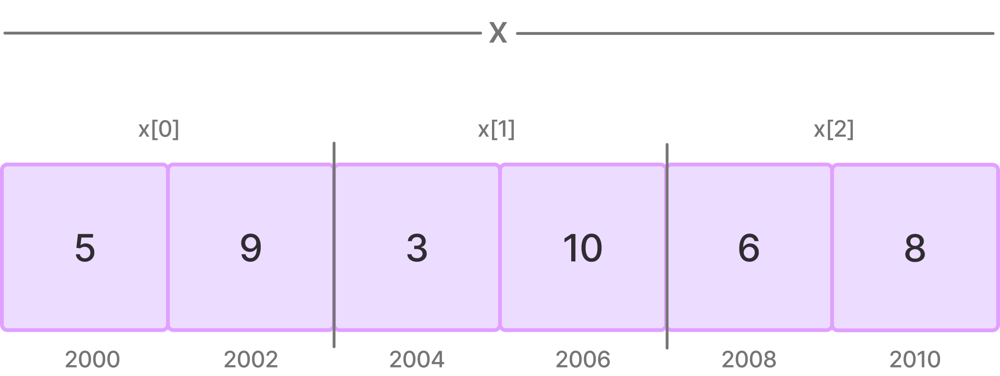
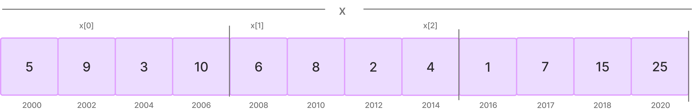

# Pointers and 2D Arrays

```c
int x[3][2] = {{5,9}, {3,10}, {6,8}};
```

Here, we have declared a 2D array of integers with 3 rows and 2 columns.

or

3 1D arrays having 2 elements.



name of array x is a constant pointer to x[0] 1d array of 2 elements. 

x = 2000

*x = x[0] = 2000

&x = 2000

x + 1 = 2004

*x + 1 = 2002

&x + 1 = 2010

```c
int x[3][4] = {{5, 9, 3, 10}, {6, 8, 2, 4}, {1, 7, 15, 25}};
```


x = 2000

x + 1 = 2008

x + 2 = 2016

*x = 2000

*x + 1 = 2002

*(x + 1) = 2008

*(*(x + 1) + 2) = 2 = x[1][2]

**x = 5


> int x[] = int *a

 <!-- video 78 -->


