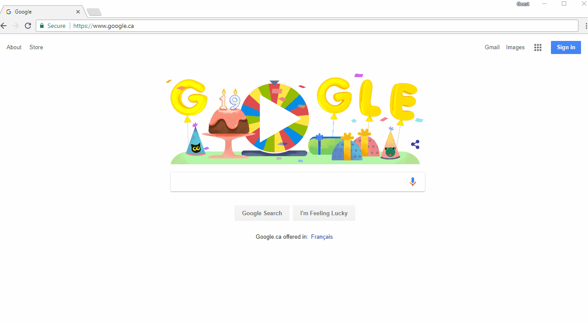
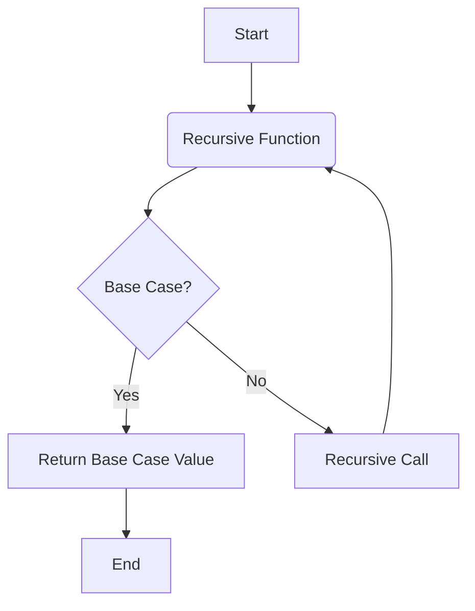

# Recursion

Self calling functions. i.e inside the definition of a function, the function is called.

Repiteadly doing the same thing again and again is recursion. 

Solving bigger problem using smaller problems is recursion. 

Recursive programs have a termination condition and a base case. If there is no base case, the program will run indefinitely and cause stack to overflow.

function call means push in stack and function return means pop from stack.

As soon as a fucntion is called it's activiation record is pushed onto the stack. 

Number of stack units required for a recursive program is directly proportional to the depth of the recursion tree.

In comparision a non-recursive program requires less or equal stack space.

### Variables in recursion:

1. Arguements
2. Return Value
3. Body of the function

### To understand and approach a recursive program:

1. Understand the problem statement and break it into smaller problems.
2. Figure out recurrence relation
3. Make stack or recursion tree to understand the flow of the program
4. Use a debugger
5. See how and what type of values are returned at each step. See where the fucntion call comes out with each value.

