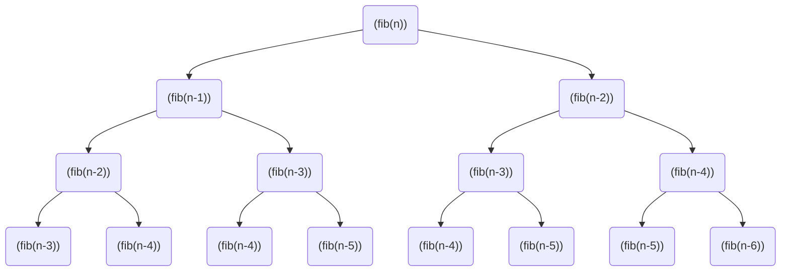
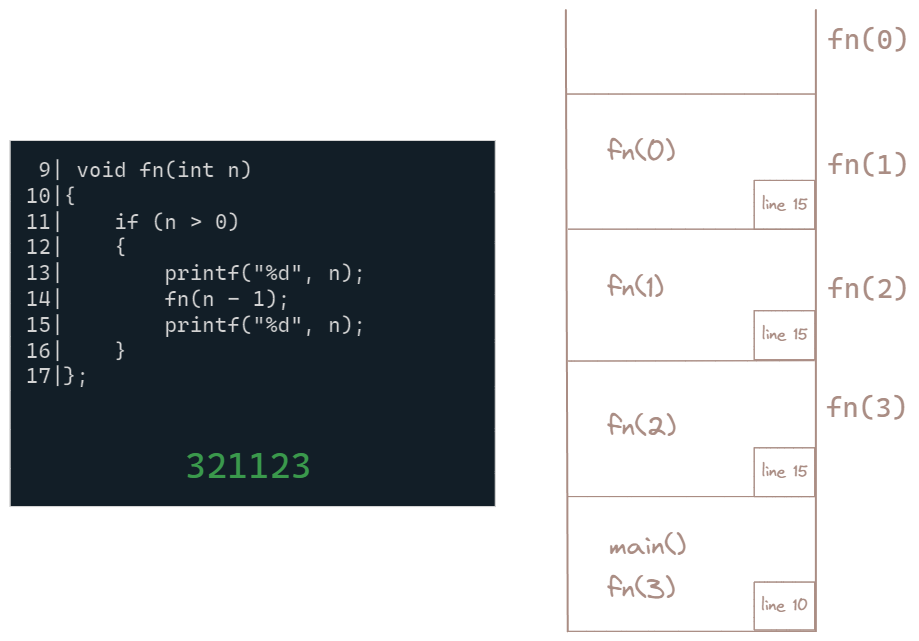

# Problems

#### To calculate $n^m$ using recursion. n and m are positive integers:

pow(2,0) = 1

por(2,1) = 2

pow(2,2) = 2 * 2 = 4

pow(2,3) = 2 * 2 * 2 = 8

<br>

pow(2,3) = 2 * pow(2,2)

pow(2,2) = 2 * pow(2,1)

pow(2,1) = 2 * pow(2,0)

pow(2,0) = 1

```c
int pow(int x, int y) {
    if (y == 0) {
        return 1;
    } else {
        return x * pow(x, y-1);
    }
}
```

#### To find nth number of fibonacci series using recursion:

fib(0) = 0

fib(1) = 1

fib(2) = 1

fib(3) = 2

fib(4) = 3

<br>

fib(4) = fib(3) + fib(2)

fib(3) = fib(2) + fib(1)

fib(2) = fib(1) + fib(0)

fib(1) = 1

fib(0) = 0

recurrence relation is fib(n) = fib(n-1) + fib(n-2)

```c
int fib(int n) {
    if (n == 0) {
        return 0;
    } else if (n == 1) {
        return 1;
    } else {
        return fib(n-1) + fib(n-2);
    }
}
```



Here, Each node represents a call to the fib function with the corresponding parameter. The function recursively calls itself with n-1 and n-2 until reaching the base cases of 0 and 1.

#### Printing Numbers from n to 1 and Back




```C
void fn(int n)
{
    if(n == 0)
    return;
    fun(n/2);
    printf("%d", n%2);
}
```

```C
int fn(int x, int y)
{
    if(x == 0)
    return y;
    else
    return f(x-1, x+y);
}
```

```C
void fn(int n)
{
    int i = 0;
    if(n > 1)
    fn(n-1)
    for(i=0; i<n; i++)
    printf("*");
    printf("\n");
}
void main(){
    fn(4)
}
```

```C
int fn(int *a, int n)
{
    if (n <= 0) return 0;
    else if (*a % 2 == 0) return *a + f(a+1, n-1);
    else return f(a+1, n-1);    
}

int main()
{
    int a[] = {12, 7, 13, 4, 11, 6};
    printf("%d", f(a, 6));
    return 0;
}
```

```C
void abc(char*s)
{
    if(s[0]=='\0') return;
    abc(s+1);
    abc(s+1);
    printf("%c", s[0]);
}

main()
{
    abc("123");
}
```

```C
void foo(int n, int sum)
{
    int k = 0, j = 0;
    if(n == 0) return;
    k = n % 10l
    j = n/10;
    sum = sum + k;
    foo(j, sum);
    printf("%d", k);
}
int main()
{
    int a = 2048, sum = 0;
    foo(a, sum);
    printf("%d", sum);
}
```