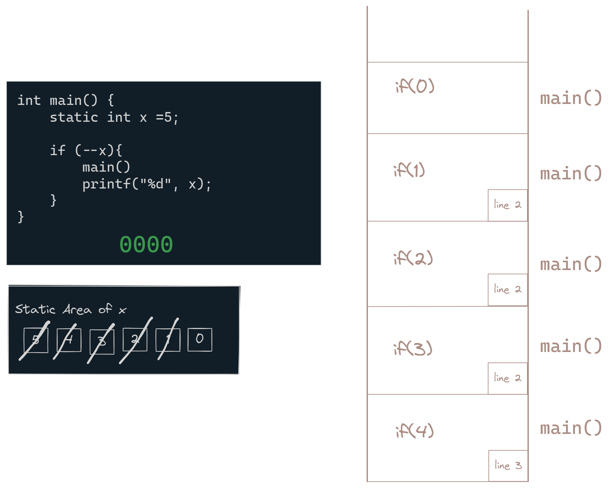

# Storage Classes

Storage classes define 4 properties of a variable in C:

1. Storage class: The storage class of a variable determines where the variable is stored in memory. stored in RAM or CPU registers.  There are 4 storage classes in C:
    - **auto**: Variables with the `auto` storage class are stored on the stack.
    - **register**: Variables with the `register` storage class are stored in the CPU registers. Registers are faster and limited in number, so the compiler may ignore the `register` keyword.
    - **static**: Variables with the `static` storage class are stored in the data segment. Defined only once and retains its value between function calls; memory is not deallocated when the function exits. Default value is 0. static variables can be accessed only in the declared file. 
    - **extern**: Variables with the `extern` storage class are used to declare variables that are defined in another part of the program. The extern keyword does not allocate memory for the variable but rather informs the compiler about the existence of a variable defined elsewhere. When a local variable shares the same name as a global variable, the local variable takes precedence within its scope. To access the global variable in such a scenario, you can use the scope resolution operator :: If global variable is initialized then memory will be allocated for it. 

|          | Storage  | Default Value | Scope                    | Lifetime            |
| -------- | -------- | ------------- | ------------------------ | ------------------- |
| Auto     | RAM      | garbage       | D.B Defining Block scope | D.B                 |
| Register | Register | garbage       | D.B                      | D.B                 |
| Static   | RAM      | 0             | D.B                      | W.P   Whole Program |
| Extern   | RAM      | 0             | W.P                      | W.P                 |

1. **Default initial value**: The default value of a variable is the value it has before it is initialized. The default value of a variable depends on its storage class and scope. For example, the default value of an `auto` variable is garbage, while the default value of a `static` variable is 0.

2. **Scope**: The scope of a variable is the part of the program where the variable can be accessed. There are 4 types of scope in C:
    - **Block scope**: Variables declared inside a block (within curly braces) have block scope.
    - **Function scope**: Variables declared inside a function have function scope.
    - **File scope**: Variables declared outside of all functions have file scope.
    - **Function prototype scope**: Variables declared in a function prototype have function prototype scope.

3. **Lifetime**: The lifetime of a variable is the period of time during which the variable exists in memory. There are 3 types of lifetime in C:

    - **Automatic storage duration**: Variables with automatic storage duration are created when the block in which they are declared is entered, and destroyed when the block is exited.
    - **Static storage duration**: Variables with static storage duration are created when the program starts and destroyed when the program ends.
    - **Dynamic storage duration**: Variables with dynamic storage duration are created and destroyed by the programmer using functions like `malloc()` and `free()`.

3 Areas in memory management:
1. Statick Area: Global variables, static variables, and constant variables are stored in the static area.
2. Stack Area: Local variables are stored in the stack area.
3. Heap Area: Dynamically allocated memory is stored in the heap area.

During compile time, memory will be allocated for global and static variables in static area.

During run time, memory will be allocated for local variables in runtime stack area.

