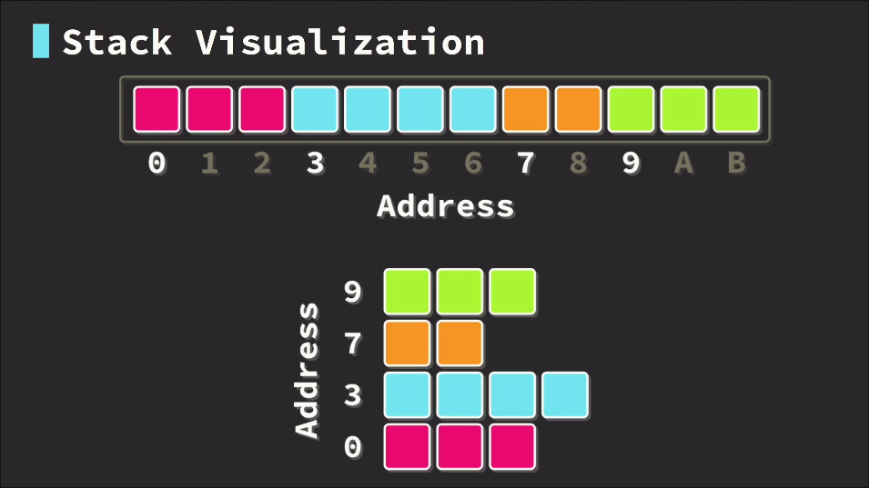
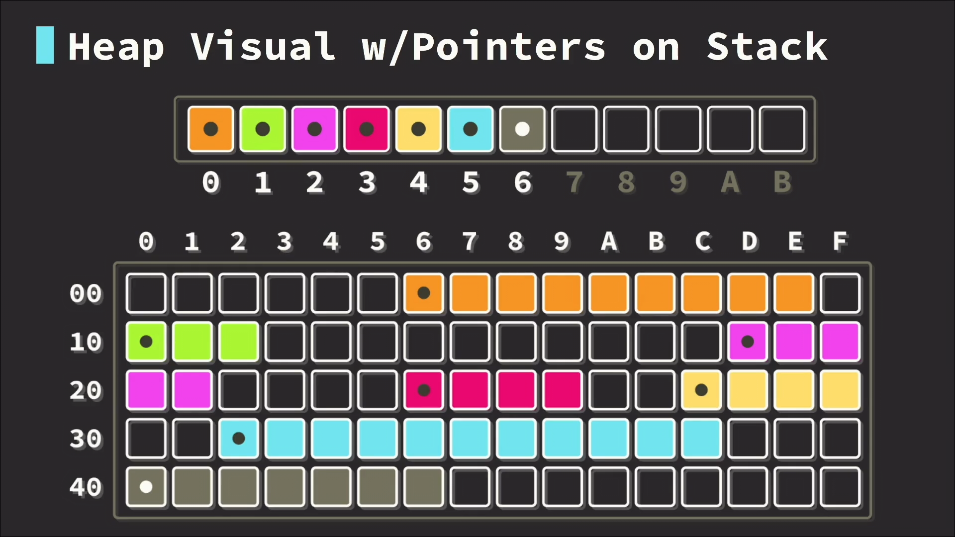

# Memory

## Stack

- Data placed sequentially
- LIFO (Last In First Out)
- All variables are stored in the stack
  - this does not mean all the data is on the stack
- Very fast to work with the stack



## Heap

- Data placed algorithmically
  - slower than stack
- Unlimited space
- Uses pointers
  - `usize` data type
- All dynamincally sized collections use Heap
  - Eg. Vextors and HashMaps




### Placing data on the heap

```rust
struct Entry {
  id: i32,
}

fn main() {
  let entry = Box::new(Entry { id: 1 });
  println!("{}", entry.id);
  let data_stack = *data_ptr // to put it on the stack. dereferencing
}
```