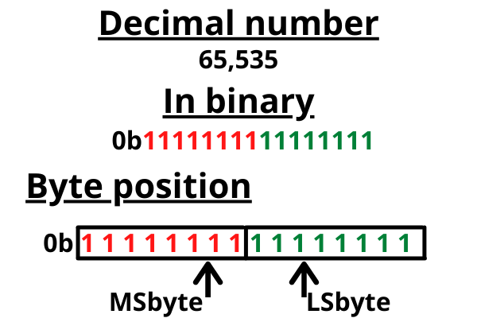

# Endianness

Endianness is the fundamental part of how computers read and understand bytes. It is the order of bytes in a multi-byte data type. 

There are two types of endianness:

1. **Big-endian**: The most significant byte is stored first and at the lowest memory address.
2. **Little-endian**: The least significant byte is stored at the lowest memory address.

When discussing endianness, we often refer to the byte holding the smallest position as the Least Significant Byte (LSbyte) and the bit holding the smallest position as the Least Significant Bit (LSbit). Conversely, the byte occupying the most significant position is known as the Most Significant Byte (MSbyte), and the bit holding the most significant bit position is termed the Most Significant Bit (MSbit).

Big endian stores data MSbyte first

Little endian stores data MSbyte last

Big-endian encoding is notably prevalent in network protocols, often termed as the network order. Conversely, the little-endian format is commonly found in personal computer architectures.

